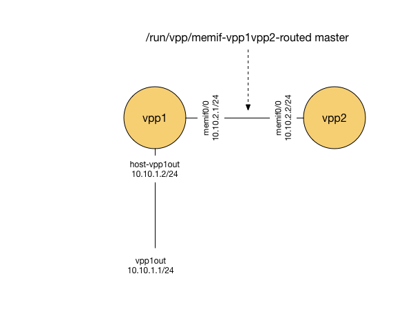

## 路由

### 可以学习到的技能

在这个练习中您将学习到这些新技能：
1. 为主机路由表添加路由
2. 为FD.io VPP路由表添加路由

重温旧的练习：
1. 检查FD.io VPP路由表
2. 在vpp1和vpp2开启跟踪功能
3. 从主机ping FD.io VPP
4. 检查和清除vpp1和vpp2上的跟踪信息
5. 从FD.io VPP ping主机
6. 检查和清除vpp1和vpp2上的跟踪信息

### 练习学习到的命令
1. [ip route add]()

### 拓扑


***Connect two FD.io VPP topology***

### 初始状态

此处的初始状态被假定为***连接两个FD.io VPP实例***的练习的最终状态。

### 设置主机路由

```
$ sudo ip route add 10.10.2.0/24 via 10.10.1.2
$ ip route
default via 10.0.2.2 dev enp0s3
10.0.2.0/24 dev enp0s3  proto kernel  scope link  src 10.0.2.15
10.10.1.0/24 dev vpp1host  proto kernel  scope link  src 10.10.1.1
10.10.2.0/24 via 10.10.1.2 dev vpp1host
```

### 在vpp2上设置返回路由

```
$ sudo vppctl -s /run/vpp/cli-vpp2.sock
 vpp# ip route add 10.10.1.0/24  via 10.10.2.1
```

### 在主机上通过vpp1 ping vpp2

从vpp1到vpp2的连接使用memif驱动程序，到主机的连接使用af-packet驱动程序。要跟踪来自主机的数据包，我们使用af-packet-input，要跟踪从vpp1到vpp2的的数据包，我们使用memif-input。

1. 在vpp1和vpp2上设置跟踪
2. 从主机Ping 10.10.2.2
3. 检查vpp1和vpp2上的的跟踪信息
4. 清除vpp1和vpp2上的跟踪信息