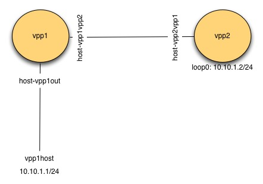

## 交换

### 可以学习到的技能

在这个练习中您将学习到这些新技能：
1. 将一个接口关联到一个桥域（bridge domain）
2. 创建一个loopback接口
3. 为桥域创建一个桥虚拟接口（BVI, Bridge Virtual Interface）
4. 检查桥域

### 练习学习到的命令
1. [show bridge]()
2. [show bridge detail]()
3. [set int l2 bridge]()
4. [show l2fib verbose]()

### 拓扑


***Switching Topology***

### 初始状态

与以前的练习不同，对于此练习，您要开始进行表格绘制。

注意：您将丢失FD.io VPP实例中的所有现有配置！

要从以前的练习中清除现有配置，请运行：

```
$ ps -ef | grep vpp | awk '{print $2}'| xargs sudo kill
$ sudo ip link del dev vpp1host
$ # do the next command if you are cleaning up from this example
$ sudo ip link del dev vpp1vpp2
```

### 运行FD.io VPP实例

1. 运行一个vpp示例，命名为vpp1
2. 运行一个vpp示例，命名为vpp2

### vpp1连接主机

1. 创建一对veth接口，一端命名为vpp1host，另一端命名为vpp1out 
2. 连接vpp1out到vpp1
3. vpp1host设置ip地址为10.10.1.1/24

### vpp1连接vpp2

1. 创建一对veth接口，一端命名为vpp1vpp2，另一端命名为vpp2vpp1 
2. 连接vpp1vpp2到vpp1
3. 连接vpp2vpp1到vpp2

### 配置vpp1上的桥域

检查并查看哪些桥域已经存在，然后选择第一个未使用的桥域：

```
vpp# show bridge-domain
 ID   Index   Learning   U-Forwrd   UU-Flood   Flooding   ARP-Term     BVI-Intf
 0      0        off        off        off        off        off        local0
```

在上面的示例中，桥域ID已经为“0”。即使有时我们可能会收到以下反馈：

```
no bridge-domains in use
```

桥域ID“0”仍然存在，不支持任何操作。例如，如果我们尝试将host-vpp1out和host-vpp1vpp2添加到网桥域ID 0，则将无法进行任何设置。

```
vpp# set int l2 bridge host-vpp1out 0
vpp# set int l2 bridge host-vpp1vpp2 0
vpp# show bridge-domain 0 detail
show bridge-domain: No operations on the default bridge domain are supported
```

因此，我们将创建桥域1，而不是使用默认桥域ID 0。

添加接口host-vpp1out到桥域1：

```
vpp# set int l2 bridge host-vpp1out 1
```

添加接口host-vp1vpp2到桥域1：

```
vpp# set int l2 bridge host-vpp1vpp2  1
```

检查桥域1：

```
vpp# show bridge-domain 1 detail
BD-ID   Index   BSN  Age(min)  Learning  U-Forwrd  UU-Flood  Flooding  ARP-Term  BVI-Intf
1       1      0     off        on        on        on        on       off       N/A

        Interface           If-idx ISN  SHG  BVI  TxFlood        VLAN-Tag-Rewrite
    host-vpp1out            1     1    0    -      *                 none
    host-vpp1vpp2           2     1    0    -      *                 none
```

### 配置vpp2上的loopback接口

```
vpp# create loopback interface
loop0
```

给vpp2的接口loop0添加ip地址为10.10。1.2/24，设置vpp2上的loop0接口状态为up。

### 配置vpp2上的桥域

检查并查看第一个可用的桥域ID（在当前情况下，可能是1）。

添加接口loop0为桥域1的bvi（bridge virtual interface）接口。

```
vpp# set int l2 bridge loop0 1 bvi
```

将接口vpp2vpp1加入桥域1。

```
vpp# set int l2 bridge host-vpp2vpp1  1
```

### 从主机ping vpp和从vpp ping主机

1. 在vpp1和vpp2上添加跟踪
2. 从主机ping 10.10.1.2
3. 检查和清除vpp1和vpp2上的跟踪信息
4. 从vpp2 ping 10.10.1.1
5. 检查和清除vpp1和vpp2上的跟踪信息

### 检查l2 fib
```
vpp# show l2fib verbose
Mac Address     BD Idx           Interface           Index  static  filter  bvi   Mac Age (min)
de:ad:00:00:00:00    1            host-vpp1vpp2           2       0       0     0      disabled
c2:f6:88:31:7b:8e    1            host-vpp1out            1       0       0     0      disabled
2 l2fib entries
```

```
vpp# show l2fib verbose
Mac Address     BD Idx           Interface           Index  static  filter  bvi   Mac Age (min)
de:ad:00:00:00:00    1                loop0               2       1       0     1      disabled
c2:f6:88:31:7b:8e    1            host-vpp2vpp1           1       0       0     0      disabled
2 l2fib entries
```